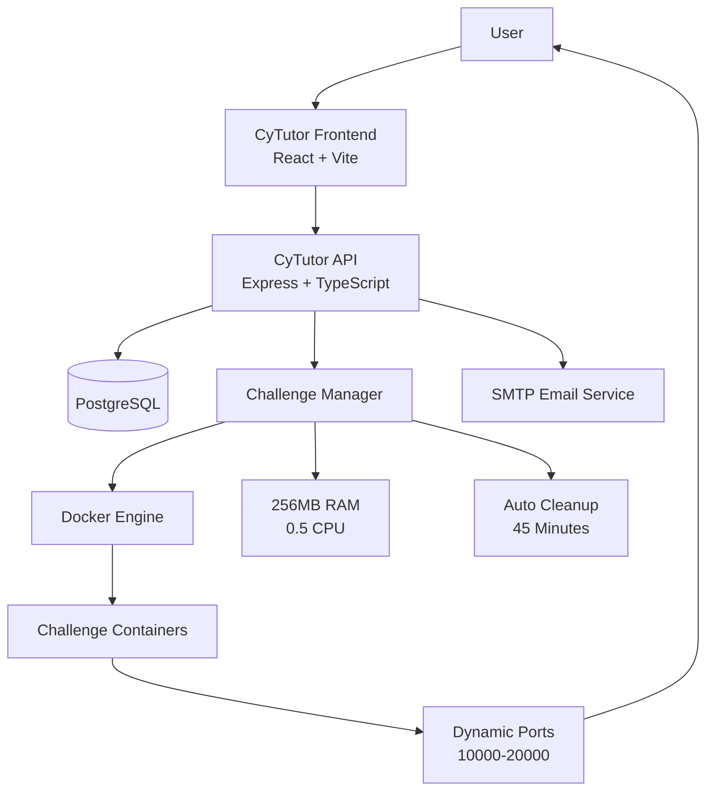
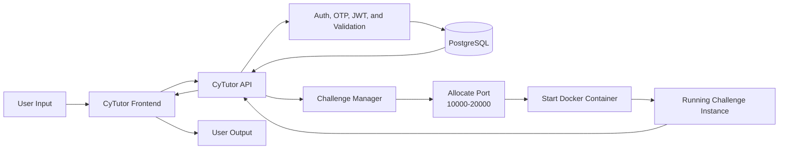
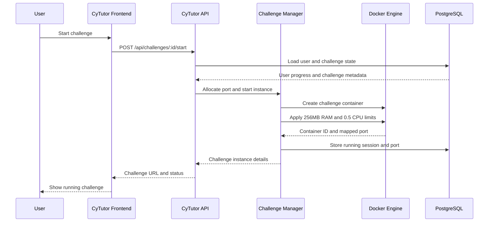
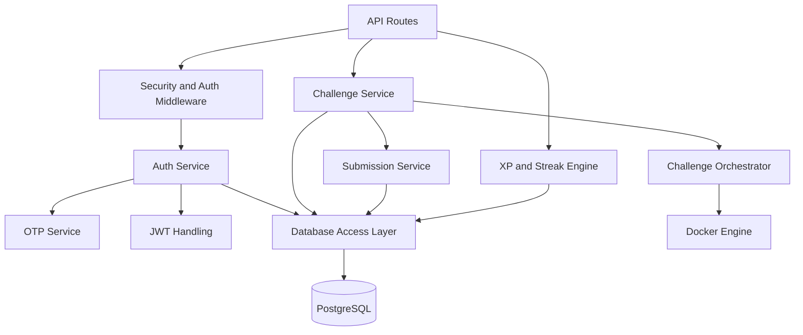
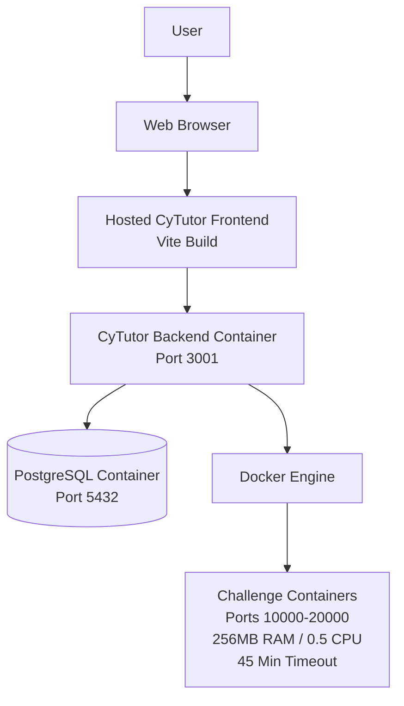
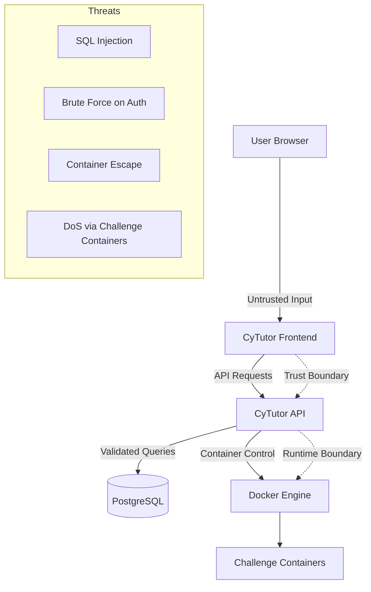

# CyTutor System Design

## 1. System Architecture

### Explanation

- This diagram shows the main runtime structure of the CyTutor platform.
- The user interacts with the React and Vite frontend in the browser.
- The frontend sends API requests to the Express and TypeScript backend, which stores platform data in PostgreSQL.
- The challenge manager controls Docker-based labs and exposes each instance on a dynamically allocated port in the `10000-20000` range.
- The orchestrator enforces the resource and timeout rules described in the implementation report.

## 2. Data Flow Diagram (DFD)

### Explanation

- This diagram shows the two main pipelines in CyTutor: platform data flow and challenge execution flow.
- The frontend captures user input and sends it to the backend API.
- Authentication, OTP handling, JWT checks, and validation happen before protected actions are processed.
- Persistent user, progress, and content data is stored in PostgreSQL, while challenge start requests follow a separate path through port allocation and Docker container startup.
- The processed result is returned to the frontend and displayed to the user.

## 3. Sequence Diagram

### Explanation

- This diagram shows the challenge startup sequence implemented by the backend and orchestrator.
- The user triggers the action from the frontend, which sends a start request to the backend API.
- The backend checks PostgreSQL to confirm challenge state and user progress.
- The challenge manager allocates a port, creates the container, and applies the configured runtime limits.
- The running session is stored in PostgreSQL before the challenge URL is returned to the frontend.

## 4. Component Diagram

### Explanation

- This diagram shows the main backend modules that power authentication, challenge execution, submissions, and gamification.
- API routes feed into shared security and authentication middleware before service logic runs.
- The auth path uses OTP and JWT handling to support verified login and protected API access.
- Challenge and submission services use the orchestrator to start, stop, and validate isolated challenge sessions.
- The XP and streak engine updates progress data through the shared PostgreSQL access layer.

## 5. Deployment Diagram

### Explanation

- This diagram shows where the main CyTutor components run in deployment.
- The user accesses the hosted frontend from a web browser.
- The frontend communicates with the backend service running on port 3001, and the backend stores data in the PostgreSQL service running on port 5432.
- Docker runs the isolated challenge containers and exposes them on the configured challenge port range.
- Each challenge container follows the deployment constraints from the report: limited memory, limited CPU, and automatic timeout cleanup.

## 6. Threat Model Diagram

### Explanation

- This diagram highlights the main trust boundaries in the CyTutor system.
- Untrusted input enters through the user browser and reaches the frontend first.
- The backend is the main enforcement layer for OTP verification, JWT checks, validation, sanitization, and rate limiting before database access.
- PostgreSQL is protected from direct user access, while Docker and the challenge containers form a separate runtime boundary for intentionally vulnerable labs.
- This view highlights the main risks the platform must control, including injection, brute-force login attempts, container abuse, and isolation failures.

## 7. System Invariants

- Each user receives an isolated challenge container instance rather than a shared runtime.
- Challenge instances are exposed through dynamically allocated ports in the `10000-20000` range.
- All challenge containers run with enforced limits of `256MB RAM` and `0.5 CPU`.
- Challenge sessions are time-bound and cleaned up automatically after `45 minutes`.
- Protected user actions pass through authentication, validation, and backend enforcement layers before state changes are applied.
